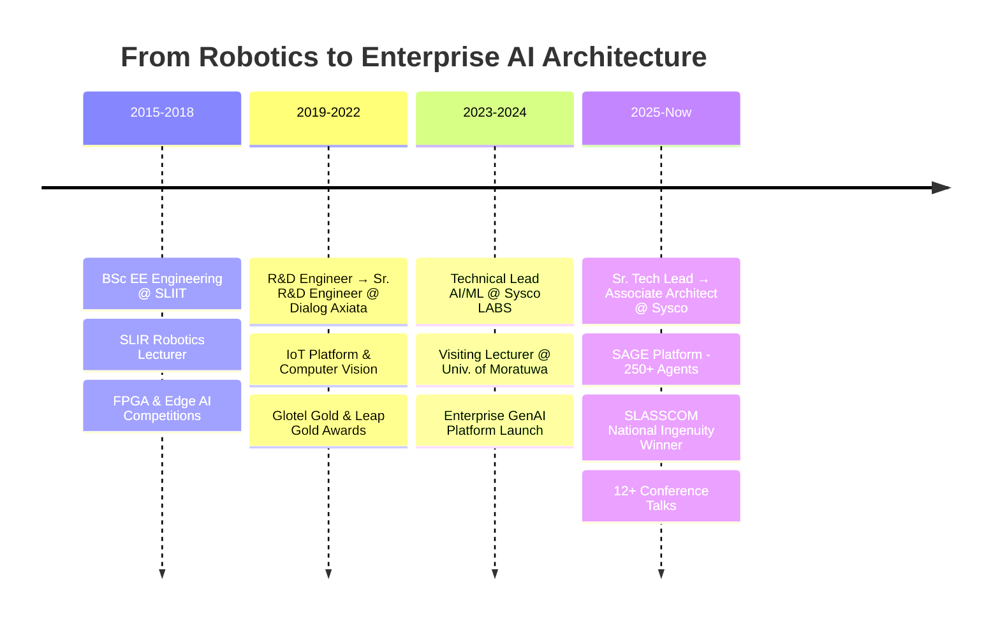

<!-- Header Banner -->
<div align="center">
  
</div>

<!-- Typing SVG -->
<div align="center">
  <a href="https://git.io/typing-svg">
    
  </a>
</div>

<br/>

<!-- Quick Badges -->
<div align="center">
  <a href="https://github.com/pasindu-94"></a>
  <a href="https://github.com/pasindu-94"></a>
  <a href="https://github.com/pasindu-94"></a>
</div>

<br/>

<!-- Social Links -->
<div align="center">
  <a href="mailto:pasindu.liyanage@hotmail.com">
    
  </a>
  <a href="https://www.linkedin.com/in/pasindu-liyanage">
    
  </a>
  <a href="https://github.com/pasindu-94">
    
  </a>
</div>

---

##  &nbsp;About Me

```yaml
name: Pasindu Liyanage
title: Associate Architect – AI/ML
company: Sysco LABS (Sysco Corp – Fortune 56)
location: Sri Lanka 🇱🇰

mission: >
  Turning LLM capability into durable enterprise products
  with multi-million-dollar impact

currently:
  - Leading the Sysco Agentic AI Platform "SAGE"
  - Architecting multi-agent systems at enterprise scale
  - Driving AI adoption across 20+ business solutions

previously:
  - Associate Lead Engineer @ Dialog Axiata PLC
  - Visiting Lecturer @ University of Moratuwa
  - Robotics Programme Manager @ SLIR

education: BSc (Hons) Electrical & Electronic Engineering – SLIIT

fun_fact: "Started with Arduino robots, now orchestrating 250+ AI agents 🤖"
```

---

##  &nbsp;What I've Built

<table>
<tr>
<td width="50%" valign="top">

### 🏗️ SAGE – Agentic AI Platform
> Sysco's enterprise agentic AI platform  
> **50+ applications** · **250+ agents** · **$3M+ impact**  
> Incubation → enterprise rollout in **<12 months**

</td>
<td width="50%" valign="top">

### 🤝 AI360 Tastebud Sales Copilot
> Sales consultant copilot for **5,000+ reps**  
> Drastically reduced search-to-answer time  
> Accelerated new rep onboarding

</td>
</tr>
<tr>
<td width="50%" valign="top">

### 📦 Smart Catalog
> AI-powered catalog for **300k+ SKUs**  
> Text + imagery understanding  
> Cut manual listing ops significantly

</td>
<td width="50%" valign="top">

### 🧪 Qualify Genie
> End-to-end **QA lifecycle automation**  
> Powered by agentic AI  
> Reduced M&A onboarding cycle time by **60%**

</td>
</tr>
</table>

---

##  &nbsp;Tech Arsenal

<div align="center">

### 🧠 AI / ML Core


### ☁️ Cloud & Infrastructure


### 🔗 Data & APIs


### 📊 Observability & DevOps


### 🔌 IoT & Embedded


</div>

---

##  &nbsp;Awards & Recognition

<div align="center">

| 🏆 Award | 🏢 Organization |
|:---|:---|
| **2× SLASSCOM National Ingenuity Winner 2025** | Sysco / SLASSCOM |
| **NextGen Supply Chain Digital Transformation Award** | Sysco |
| **Hall of Fame – Best Engineering Project** | Sysco LABS |
| **Global Tech Award – Entrepreneurial Thinking** | Sysco Corp |
| **Glotel Gold 2019 – Best Industrial IoT** | Dialog Axiata |
| **Leap Gold 2020 – Best Digitization Project** | Dialog Axiata |
| **Innovation of the Year 2021 (COVID AI)** | Dialog Axiata |
| **Iron Award – Innovate FPGA (Asia Pacific & Japan)** | Terasic Inc. |
| **Best Use of AI – Intelligence at the Edge** | Avnet & Xilinx |

</div>

---

##  &nbsp;Speaking & Community

<div align="center">

🎤 **12 sessions in 2024–2025** across conferences, panels, and guest lectures

</div>

<table align="center">
<tr>
<td align="center" width="25%"><strong>🌐 Regional Scrum<br/>Gathering 2025</strong></td>
<td align="center" width="25%"><strong>🔴 Google I/O Extended<br/>Sri Lanka 2024</strong></td>
<td align="center" width="25%"><strong>🤖 Sri Lanka AI Forum<br/>Panelist</strong></td>
<td align="center" width="25%"><strong>🎓 University of Moratuwa<br/>Guest Lecturer</strong></td>
</tr>
<tr>
<td align="center" width="25%"><strong>⚖️ Sri Lanka AI<br/>Challenge Judge</strong></td>
<td align="center" width="25%"><strong>🧑‍🏫 Certified Mentor<br/>Training Consortium</strong></td>
<td align="center" width="25%"><strong>📋 CSPO®<br/>Scrum Alliance</strong></td>
<td align="center" width="25%"><strong>📊 HarvardX<br/>Data Science with R</strong></td>
</tr>
</table>

---

##  &nbsp;GitHub Analytics

<div align="center">
  
  
</div>

<div align="center">
  
</div>

<div align="center">
  
</div>

---

##  &nbsp;Featured Projects

<div align="center">
  <a href="https://github.com/pasindu-94/rag-implementation-aidsl">
    
  </a>
  <a href="https://github.com/pasindu-94/gpTutor">
    
  </a>
  <a href="https://github.com/pasindu-94/solar-power-prediction-multi-inverter">
    
  </a>
  <a href="https://github.com/pasindu-94/line-follower">
    
  </a>
</div>

---

##  &nbsp;Career Journey



---

<div align="center">

### 💬 Let's Connect

*I'm always interested in discussing **Agentic AI**, **Enterprise LLM Orchestration**, **Multi-Agent Systems**, and **Responsible AI** at scale.*

*Open to speaking engagements, mentorship, and collaboration on impactful AI projects.*

<br/>

<a href="mailto:pasindu.liyanage@hotmail.com">
  
</a>
<a href="https://www.linkedin.com/in/pasindu-liyanage">
  
</a>

</div>

<br/>

<!-- Snake Animation -->
<div align="center">
  <picture>
    <source media="(prefers-color-scheme: dark)" srcset="https://raw.githubusercontent.com/pasindu-94/pasindu-94/output/github-snake-dark.svg" />
    <source media="(prefers-color-scheme: light)" srcset="https://raw.githubusercontent.com/pasindu-94/pasindu-94/output/github-snake.svg" />
    
  </picture>
</div>

<!-- Footer Wave -->

